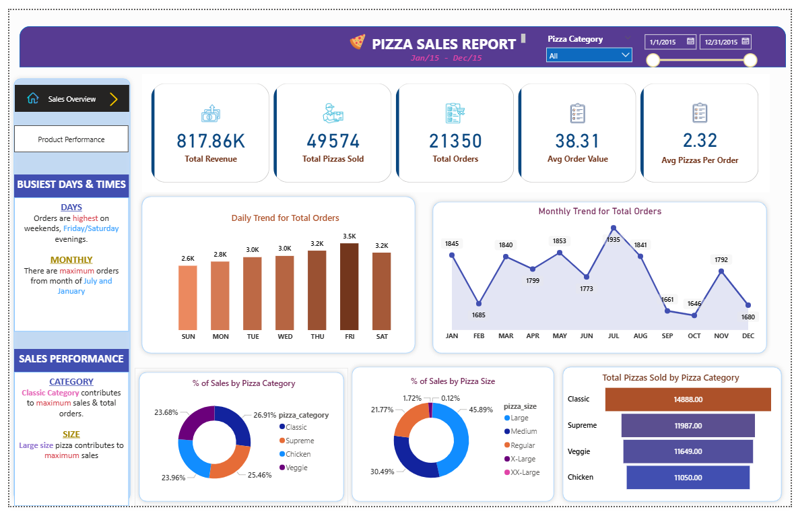
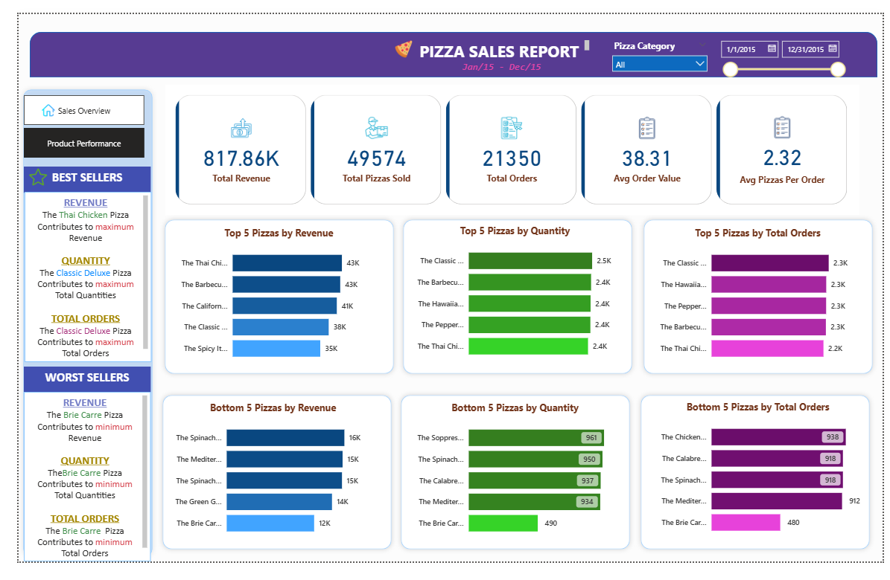

# Pizza Sales Analysis Dashboard

## Overview

This project analyzes pizza sales data using SQL and Power BI to uncover business insights, sales trends, and product performance. The dashboard provides an interactive view of revenue performance, order behavior, and best-selling products.

The analysis focuses on understanding customer purchasing patterns, identifying top and low-performing pizzas, and exploring how different pizza categories and sizes contribute to overall revenue.

---

## Tools & Technologies

* SQL (Data analysis and KPI calculations)
* Power BI (Data visualization and dashboard design)
* Data modeling
* Business intelligence analysis

---

## Dataset

The dataset contains transaction-level pizza sales information including:

* Order ID
* Order date and time
* Pizza name
* Pizza category
* Pizza size
* Quantity sold
* Total price

---

## Key Performance Indicators (KPIs)

The following metrics were calculated using SQL and visualized in Power BI:

* **Total Revenue:** 817.86K
* **Total Orders:** 21,350
* **Total Pizzas Sold:** 49,574
* **Average Order Value:** 38.31
* **Average Pizzas per Order:** 2.32

---

## Dashboard Features

The Power BI dashboard provides the following insights:

### Sales Overview

* Revenue summary
* Total pizzas sold
* Total orders
* Average order value

### Order Trends

* Daily trend for total orders
* Monthly trend for order activity

### Sales Distribution

* Percentage of sales by pizza category
* Percentage of sales by pizza size

### Product Performance

* Top 5 pizzas by revenue
* Top 5 pizzas by quantity sold
* Top 5 pizzas by total orders
* Bottom 5 pizzas by revenue
* Bottom 5 pizzas by quantity
* Bottom 5 pizzas by orders

---

## Key Insights

* Orders are highest on **weekends**, especially **Friday evenings**.
* **Classic pizza category** contributes the highest share of overall sales.
* **Large pizzas generate the most revenue**, indicating strong customer preference.
* Some pizzas consistently appear in the **bottom sales group**, highlighting opportunities for menu optimization.

---

## SQL Analysis

SQL was used to explore and analyze the dataset before building the Power BI dashboard.

Key analyses performed:

* Revenue and sales KPI calculations
* Daily, hourly, and monthly order trends
* Sales contribution by pizza category
* Sales contribution by pizza size
* Identification of top-performing and underperforming pizzas

The SQL queries used for the analysis are included in the file:

pizza_sales_analysis.sql

---

## Dashboard Preview

* **Sales Overview Dashboard**

    

* **Product Performance Dashboard**

    
---

## Business Problem

A pizza restaurant wants to understand its sales performance and customer ordering behavior in order to increase revenue and optimize its menu.

The key questions are:

* When are the busiest sales periods?
* Which pizza categories generate the most revenue?
* Which pizza sizes are most popular among customers?
* Which pizzas are top performers and which are underperforming?

The goal is to use data to support better sales and menu decisions.

---

## Data Analysis Approach

The analysis was performed in two stages.

**1. SQL Data Exploration**

SQL queries were used to:

* Calculate key performance indicators (KPIs)
* Identify order patterns by day and hour
* Analyze revenue contribution by category and size
* Identify top and bottom performing pizza products

**2. Power BI Visualization**

An interactive dashboard was created to present the insights using:

* KPI cards
* Trend analysis charts
* Category and size distribution charts
* Product performance rankings

---

## Business Insights

Key findings from the analysis include:

* Orders peak during **weekends and Friday evenings**, indicating strong demand during leisure periods.
* The **Classic pizza category contributes the largest share of total sales**.
* **Large pizza sizes generate the highest revenue**, suggesting customers prefer larger orders.
* Certain pizzas consistently appear in the **bottom sales rankings**, indicating low demand.

---

## Recommendations

Based on the analysis, the following actions could improve business performance:

* Increase staffing during **weekend peak hours** to manage higher order volumes.
* Promote **best-selling pizzas** in marketing campaigns to maximize revenue.
* Consider **bundling large pizzas with drinks or sides** to increase average order value.
* Review or redesign **low-performing pizzas** to improve their appeal or remove them from the menu.

---

## Business Value

This dashboard enables restaurant managers to:

* Monitor sales performance in real time
* Identify high-demand products
* Optimize staffing and inventory planning
* Improve menu strategy using data-driven insights

## Project Structure

powerbi-pizza-sales-dashboard

Pizza_Sales_Dashboard.pbix

pizza_sales_analysis.sql

dataset.csv

dashboard_screenshot.png

README.md

---

## Author

Frederick Dordaah Ngmensoro Kuuyine

